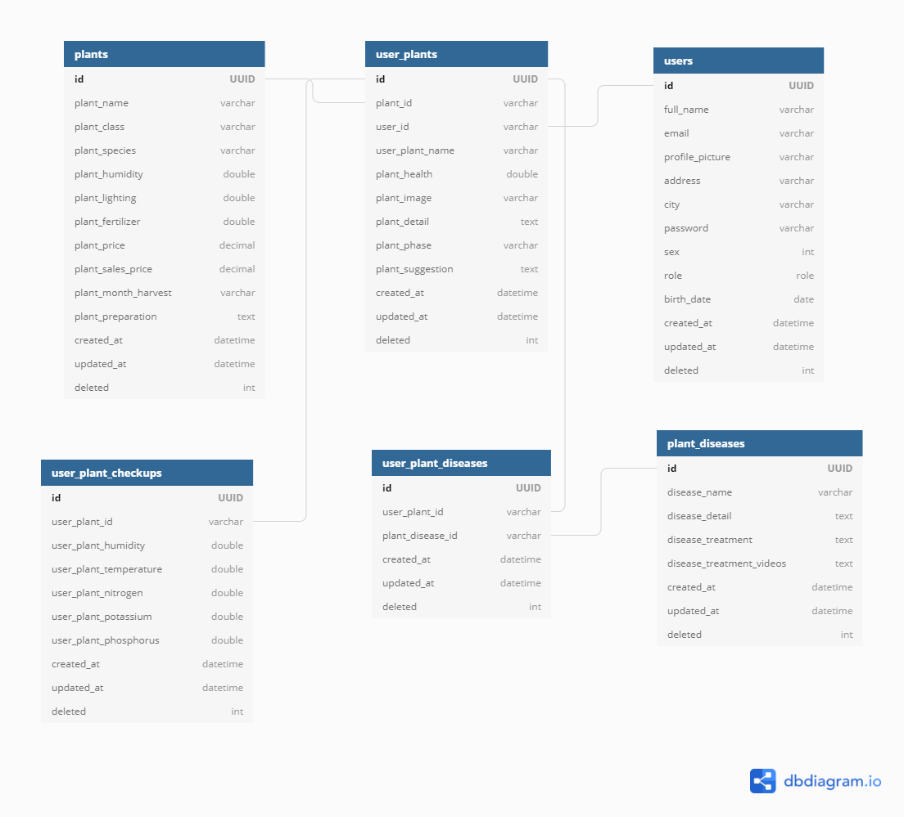

# Project Overview
+ **Selected Theme:** Food Security
+ **Title of the Project:** Application to Help Plant Enthusiasts
+ **Problem Statement**: Indonesia lacks food self-sufficiency, while other smaller nations are able to fulfill their food self-sufficiency.
+ **Background Information:** Food security is a food economic system that is integrated from various subsystems (Suryana, 2008). According to Arifin (2005), food security includes a complete combination of subsystems between the dimensions of availability, accessibility, and stability of food prices.

# Cloud Team Member
+ Anugrah Prasetia (C0060595) - Cloud Computing
+ Dewi Rizki Fitriani (C2242147) - Cloud Computing

# Technical Design
+ **Backend Framework:** Reactive Java Spring Boot
+ **Database:** PostgreSQL
+ **Cloud:** Google Cloud
+ **Auth:** JSON Web Token (JWT)
+ **Backend Deployment:** GCP App Engine
+ **AI Deployment:** GCP AI Platform
+ **ERD:** https://dbdiagram.io/d/6099a4c7b29a09603d14403f
  
  

  
